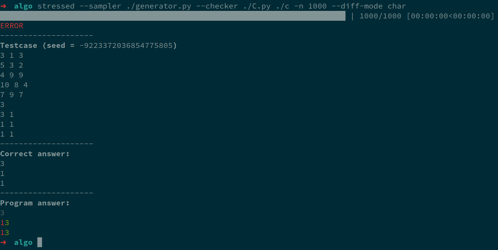

# stressed &mdash; a CLI tool to stress-test solutions in competitive programming

Often when solving competitive programming problems they fail, and
on a platform that doesn't let you see the test cases that can be a problem.
However, often it's easy to test the solution on small testcases, where another
(probably more naive and simple) solution is feasible. Then by combining *sampler*
or *generator*, which generates small test cases randomly,
and reference *solver*, broadly called *checker*, we can evaluate our solution and
fix it.
This project is aimed at providing flexible and **fast** tool to perform such testing.

## Features
- Does not interrupt the usual workflow: you only have to supply sampler, which outputs samples to stdout, and reference solver,
    which is of the same format as the solution. There is no need to modify your solution in any way.
- Fast: it uses asynchronous process spawns and outperforms naive realization by 2-5 times
- Can use random seeds for sampler to facilitate reproducible testing
- Can save the failing testcase to file automatically
- You control whether to trim trailing whitespaces in output or not
- Customizable:
    - Use default checker, which compares output with the reference solver, or use **custom checker**, which can
        check the output in any way
    - Show diffs with the correct solution (character-wise/line-wise) or do not show them at all
    - Control the number of iterations
    - Show progress bar

For details on usage see the [Usage](#usage) section.

## Installation
You can either compile from source using *cargo* or download the precompiled release files at
[Github releases](https://github.com/w3rew/stressed/releases/).
To install via cargo run
```rust
    cargo install stressed
```
You need to have Rust toolchain, including *cargo*, to do so.
The easier alternative is to use precompiled statically-linked binaries under the releases tab on Github.
Those are built using Github Actions and you can inspect the build scripts yourself, so it's safe.

## Usage

```bash
stressed --sampler ./generator.py --checker ./C.py ./c -n 1000 --diff-mode char
# Or shorter
stressed -s ./generator.py -c ./C.py ./c -n 1000 --diff-mode char
```



This command sets the number of iterations to 1000 and outputs diff per character.
Notice dots in `./generator.py` and other files: these are mandatory if using relative paths.

For other parameters please refer to [CLI docs](docs/CLI.md).

### Solution

This is the executable to test. It should accepth the testcase via *stdin* and
print the answer to *stdout*.

### Sampler
Sampler (or generator) should be an executable, which generator random tests and prints them to standard output.
It can (optionally) take random seed as command line argument for reproducible runs;
the seed will be printed in test synopsis on failure.

### Checker

Usually checker is a brute force solution to the same problem. Its output is compared to the program
character by character. However, for more complex needs you can use **custom checker** with arbitrary logic.

## Configurable options
CLI arguments besides `--use-custom-checker` are described in detail in [CLI docs](docs/CLI.md).
Briefly, you can control:

 - Whether to use custom checker (see below) or not
 - Whether to trim every line of output or just the last one
 - Whether to save the failing testcase to file or not
 - Diff mode to use. The available are line-wise, character-wise and no diff.
 - Whether to disable the progress bar
 - The number of iterations

### Custom checker
Custom checker should read both testcase and the checked solution from stdin,
one by one without any additional delimiter other than newline.
Then it should succeed (return zero exit code) if
the solution fits the testcase, or fail (return non-zero exit code) if
the solution is wrong for the testcase.
Also it can output error message, which will be written in test synopsis.

To enable set `--use-custom-checker` argument
